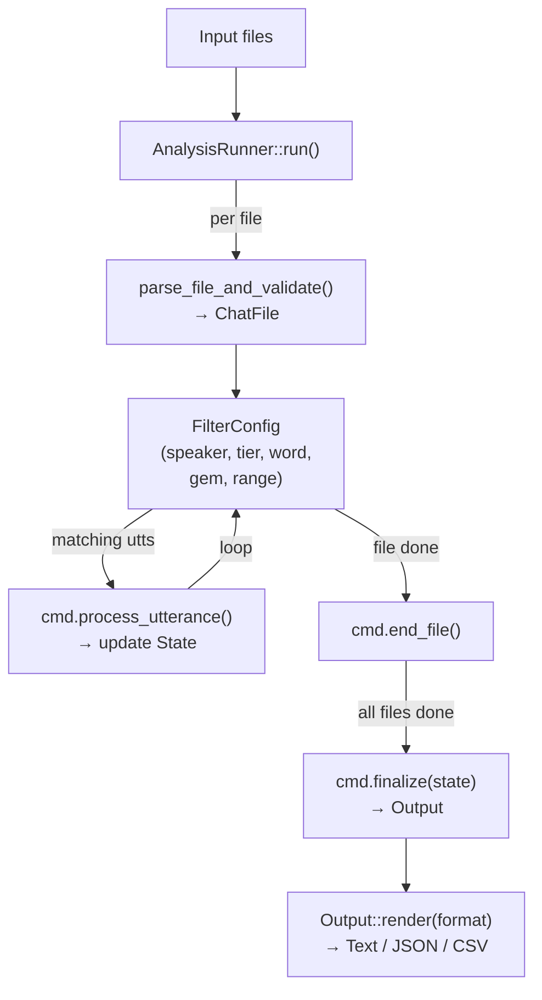
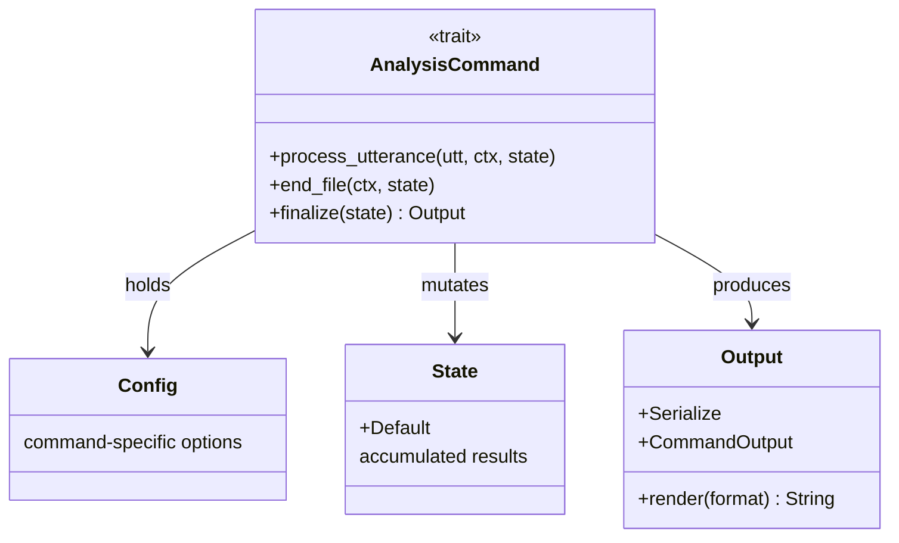

# Framework

**Status:** Current
**Last updated:** 2026-05-12 08:35 EDT

The framework (`crates/talkbank-clan/src/framework/`) provides shared infrastructure for all commands.

## Runner

The command runner (`AnalysisRunner` in `framework/runner.rs`)
handles the lifecycle:

1. **Parse**: read and parse the CHAT file via `talkbank-transform`
2. **Filter**: apply speaker, tier, word, gem, range, and ID filters
3. **Dispatch**: call `process_utterance()` for each matching utterance
4. **Per-file end**: call `end_file()` after all utterances in a file
5. **Finalize**: after all files are processed, call `finalize(state) -> Output`
6. **Render**: format the result as text, JSON, CSV, or CLAN-compatible output via `Output::render(format)`



## Traits

### `AnalysisCommand`

Per `crates/talkbank-clan/src/framework/command.rs:52`:

```rust,ignore
trait AnalysisCommand {
    type Config;
    type State: Default;
    type Output: CommandOutput;

    fn process_utterance(
        &self,
        utterance: &Utterance,
        file_context: &FileContext<'_>,
        state: &mut Self::State,
    );

    /// Called after each file. Default impl does nothing.
    fn end_file(&self, _file_context: &FileContext<'_>, _state: &mut Self::State) {}

    /// Called once after all files. Produces the typed output.
    fn finalize(&self, state: Self::State) -> Self::Output;
}
```



### `TransformCommand`

Transform commands receive a mutable `ChatFile` and modify it in place.

### `CommandOutput`

Per `crates/talkbank-clan/src/framework/output.rs:48`:

```rust,ignore
trait CommandOutput: Serialize + std::fmt::Debug {
    /// Dispatch render by format.
    fn render(&self, format: OutputFormat) -> String { ... }

    /// JSON serialization (uses the `Serialize` bound).
    fn to_json_value(&self) -> serde_json::Value { ... }

    /// Required: clean text rendering.
    fn render_text(&self) -> String;

    /// Default: falls back to `render_text()` for commands not yet
    /// CLAN-matched.
    fn render_clan(&self) -> String { self.render_text() }

    /// Default: empty string.
    fn render_csv(&self) -> String { String::new() }
}
```

JSON output is produced by `render(OutputFormat::Json)`, which uses
`serde_json::to_string_pretty(self)` via the trait's `Serialize`
bound, not a custom `render_json()` method.

## Word utilities

- `countable_words()`: iterate words that should be counted (skips untranscribed, fillers, etc.)
- `is_countable_word()`: predicate for individual words
- `NormalizedWord`: wrapper with `Borrow<str>` for zero-allocation frequency map lookups

## Filter system

Filters are configured from CLI flags and applied by the runner before dispatching to commands. Commands never check filters directly.
