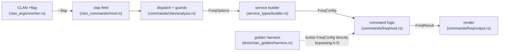

# CLAN Parity Field Guide

**Status:** Current
**Last updated:** 2026-06-12 19:01 EDT

This page is the distilled, cross-cutting **field guide** for porting a CLAN
command to byte-for-byte parity in `chatter clan`. It is not the mechanical
how-to (see [Adding a Command](adding-command.md)) and not the per-flag record
(that lives in each command page's audit table, e.g.
[FREQ](../commands/freq.md)). It is the **wisdom layer**: the patterns,
landmines, and infrastructure that the FREQ depth-first effort surfaced, written
so the next porter (FREQ flag #N, or CLAN command #2) does not re-learn them the
hard way.

It is a **living document**: append a short "what this row taught" note whenever
a flag or command surfaces a reusable lesson, and the accumulated result is the
final porting report. Much of what follows was reconstructed from FREQ's audit
notes, the divergence ledger, and commit history; future rows should add their
lesson as they land, not weeks later.

> **Why this exists.** Completing FREQ to full parity is the vehicle for
> estimating the cost of porting all of CLAN. That estimate is only as good as
> the reusable template and shared primitives the work produces. This guide
> *is* that template made explicit.

## 1. The method: source-grounded, golden-first, depth-first

The unit of work is the **command**, not the flag (see the parity strategy in
the repo `CLAUDE.md`). Within a command, each flag-row follows the same loop:

1. **Read the manual section for intent.** `CLAN.html` states what a flag is
   *intended* to do. Cite it by section. The manual and the CHAT manual are
   different documents; use `CLAN.html` for command flags.
2. **Read the command's own `getflag` in CLAN source for behavior.** This is the
   single most important habit. CLAN commands intercept flags in their own
   `getflag()` (e.g. `freq.cpp:621`, the `case 'd'`/`case 'o'` blocks) *before*
   falling through to the shared `maingetflag` (`cutt.cpp`). The book's own
   draft notes are a map, not the authority, and have been wrong (the `+c2` and
   `+d` rows both shipped with manual-only drafts that the source contradicted).
   Cite behavior `file:line`.
3. **Live-probe the binary to seed the oracle.** Run the real CLAN tool on a
   trimmed fixture, capture the exact bytes. This is not "reading the
   implementation"; the binary's output *is* the spec. Pin the residual
   uncertainties (sort order, wildcard handling, exact wording) here.
4. **Write the failing top-level test first** (golden for render parity,
   subprocess for CLI/rewriter/error paths); see §6.
5. **Implement across the five seams** (§4), then GREEN.
6. **Localize any divergence** with judgment, not reflex (§5).

Every claim about CLAN carries two citations: a manual section (intent) and a
`file:line` (behavior). Every claim about chatter carries a chatter `file:line`.

## 2. The biggest structural lesson: a flag prefix is rarely a scalar

CLAN overloads a single flag *letter* onto **multiple orthogonal state
variables**, dispatched by the characters that follow it. Modeling such a prefix
as one scalar "mode integer" is the worst kind of parity bug: it looks right and
is silently wrong for the exact users (CLAN-trained researchers) the command
targets.

FREQ `+d` (`freq.cpp:838-913`) is the canonical example. The one letter drives:

| Sub-form | CLAN state set | chatter flag |
|---|---|---|
| `+d1` | `isCombineSpeakers` + `onlydata` | `--word-list-only` |
| `+d2`/`+d3` | `onlydata=3/4` (spreadsheet) | `--spreadsheet per-word`/`summary` |
| `+d4` | `onlydata=5` (types/tokens text) | `--types-tokens-only` |
| `+d5` | `zeroMatch` (independent boolean) | `--include-zero-frequency` |
| `+d8` | `isCrossTabulation` | (deferred, `%mor` cross-tier) |
| `+d20` | `isSpreadsheetOnePerRow` | (pending) |
| `+d<N` … | `percentC` + `percent` (forces spreadsheet) | (pending) |

FREQ `+o` (`freq.cpp:815-837`) is the same shape: `+o`/`+o0` → `isSort`,
`+o1` → `revconc=1`, `+o2` → `revconc=2`+`chatmode=0`, `+o3` → `isCombineSpeakers`.

**Rule.** Decompose the prefix into its independent axes and give each a
distinct, typed chatter field (an enum when there are >2 states, a single
`include_*`/`combine_*` bool only when the name fully communicates `true`).
Never a `--display-mode N` catch-all, which both squats CLAN slots and reintroduces
boolean/int blindness. The decomposition is also the honest unit of the
porting-effort estimate: count axes, not flag letters.

## 3. The faithfulness rule, and un-squatting

Every CLAN flag slot implements CLAN's documented semantic byte-for-byte.
Chatter conveniences (new formats, ergonomic shortcuts) get **chatter-only flag
names**, never a CLAN slot.

FREQ shipped several **squats** that had to be undone: `+d2`/`+d3` were mapped to
a chatter `--format csv` stdout convenience, and `+d5`/`+d20`/etc. fell through a
generic `+dN → --display-mode N` rewrite. Un-squatting means: route the CLAN slot
to a faithful implementation, and keep the chatter convenience reachable under
its own name. Watch for squats whenever a rewriter arm maps a CLAN slot to a
pre-existing chatter flag that does not match CLAN's documented semantic.

## 4. The five implementation seams (the porting template)

A flag touches the same layers every time. Internalize this and each new flag is
a fill-in-the-blanks exercise.

1. **Rewriter** (`clan_args/rewriter.rs`): `+flag` → `--flag`, **subcommand-guarded**
   (the same `+d`/`+o` letter means different things in FREQ vs KWAL vs COOCCUR,
   so every arm matches on `subcommand`). Unmapped forms fall through to clap,
   which rejects the literal token, so an unimplemented flag *errors on paste*
   rather than silently no-oping.
2. **Clap field** (`cli/args/clan_commands/mod.rs`): the typed chatter flag.
   Value-enums for multi-state axes; bare bool only for single `include_*`/`combine_*`.
3. **Dispatch** (`commands/clan/analysis.rs`): map clap args → domain options
   via small `*_to_*` free functions (house style). **Flag-combination guards
   live here**, not in the command/service; see §7.
4. **Options → Config** (`service_types/{options,builder}.rs` →
   `commands/freq/mod.rs`): typed config field. Per-row mutable state goes in the
   `State` type; pure logic in `count_utterance`/`finalize`.
5. **Render** (`commands/freq/output.rs`): the **CLAN-format render is the parity
   target**; text/JSON/CSV are chatter's own formats and need not match CLAN.

**Sixth touch point:** the golden harness (`tests/clan_golden/harness.rs`)
constructs `FreqConfig` *directly* from the rust-side args, bypassing seams 1-4.
So a new config field needs a one-line `extra_args.contains(...)` / `parse_*`
addition in the harness too, or the golden cannot exercise it.

## 5. Localizing a divergence: four terminal states, not "make it match"

When chatter differs from the binary, the answer is judgment, grounded in the
manual, into exactly one of:

- **chatter bug** → fix chatter (the default when the binary agrees with the manual).
- **CLAN-binary bug** → diverge deliberately; mark the golden `DivergesFromClan`,
  document with **both** a manual citation and a source `file:line`. Worked
  example: **CLAN-DIV-003**, FREQ `+c1` : the manual says "uppercase in the
  middle," but the binary's `isRightUpper` loops from position 0 and also keeps
  initial-caps. chatter implements the *documented* semantic; the golden asserts
  it differs from CLAN.
- **manual mistake / outdated text** → escalate; do not decide solo.
- **data / `%mor` tagging artifact** → raise as a MOR/data matter; do not bake a
  workaround into the command.

There is a fourth **terminal** state beyond "matches/diverges": **deferred**.
FREQ `+o2` sets `chatmode=0`, reinterpreting the CHAT file as plain text and
counting whole input *lines* as tokens (`%mor:`/`@ID:`/`@Begin` included). That is
incompatible with chatter's AST-first model (it would require bypassing the
parser), so it is a documented **non-goal**, not an open gap. A command is
"done" when every row is matched, diverged, or deferred, not when every row has
a golden. This is modeled by the `Deferred` `BookStatus`, which the parity
metric excludes from the provable denominator.

## 6. Testing: golden is the render oracle, subprocess is the CLI oracle

| The flag's seam | Top-level test |
|---|---|
| Single-file render parity | **Golden** vs OSX-CLAN (`tests/clan_golden/`) |
| CLI parsing / rewriter / error paths | **Subprocess** (`assert_cmd`, `crates/talkbank-cli/tests/`) |
| Multi-file / directory orchestration (`+u`, `+re`) | Subprocess (no single-file render exists by nature) |

Write the failing test **before** the implementation. The golden is seeded from
the binary (`just regen-clan-goldens`, needs `CLAN_BIN_DIR`); the RED is then
chatter's render not matching the committed golden.

### Harness gotchas that recur for every command

- **CLAN reads stdin.** The harness pipes the fixture to the binary; the banner
  reads `From pipe input`, and the raw output carries a **doubled banner** plus a
  carriage-return **progress-garbage line** (`8\r\t  `). `strip_clan_header`
  normalizes all of this; the committed golden starts at the first real content
  line.
- **Header-less / count-first output.** `strip_clan_header` used to drop the
  first line whenever its first *token* was numeric, correct for the progress
  line, but it also ate a real count entry (`1 Triangle`) for output with no
  `Speaker:` banner (FREQ `+o3` combined mode). Fixed to drop only a *single
  numeric token* line. Any command whose output can begin with a count rather
  than a header will hit this; the fix is in place but the lesson generalizes.
- **The command-echo banner echoes your search terms.** A subprocess test that
  asserts `out.contains("zzz")` on a `+szzz` run is fooled by the echoed
  command line. Assert on the table **entry** form (` <count> <word>\n`), not raw
  stdout. (Bit `+c4`, `+u`/`+re`, and `+d5`.)
- **Verify infra changes are benign by regenerating all goldens** and confirming
  zero diff to existing files (the `strip_clan_header` fix was validated this
  way).
- **`None` (rewriter pass-through) does NOT reject a `+`-prefixed token, it
  makes it a bogus FILE argument.** Many rewriter arms return `None` with the
  comment "pass through so clap rejects the literal token." That holds for
  `-`-prefixed tokens (clap treats `-` as its option sigil and rejects unknown
  shorts) but is FALSE for `+`-prefixed tokens: clap does not treat `+` as an
  option prefix, so `+d8` / `+QQQ` pass through as a *positional*, the shared
  file-discovery layer warn-skipped it as a missing file, and the command exited
  **0 with DEFAULT output**, silently wrong for the exact CLAN-trained user the
  command targets. Fixed systemically (2026-06-04) at the
  `DiscoveredChatFiles` boundary (`talkbank-clan/src/framework/input.rs`): a
  positional beginning with `+`/`-` (a bare `-` stdin marker exempt) routes to
  `UnrecognizedClanFlagArgs`, and `into_files()` is now **fallible** so every
  consumer (the analysis service for FREQ/MLU/..., CHECK, `find`, LSP) is forced
  by the type to handle it. Lesson: an unconsumed flag-shaped token must ERROR;
  prove it with a subprocess test asserting the unknown/unimplemented flag exits
  non-zero (`inapplicable_flag_tests.rs`), not just that the *known* flags work.

## 7. Where flag-combination guards live

CLAN rejects many flag *combinations* (`+c2` needs a wildcard `+s` and forbids a
multi-word `+s`; `+d5` forbids wildcards/duplicates in `+s` and requires at least
one `+s`). These guards depend on the **extracted per-word filter**, which is
assembled at the CLI dispatch (`analysis.rs`, `take_per_word_filter`). So the
guards live there, emitting `exit_with_error`, **not** in a service-layer
`TryFrom`.

This was a deliberate altitude call (a `/simplify` pass explicitly kept the
`+c2` guard at dispatch): plumbing typed domain errors out of the service is
unreachable from the LSP today, so dispatch is the correct, consistent home.
New combination guards mirror the `+c2`/`+d5` block exactly.

## 8. Shared framework primitives (the real porting accelerant)

Extracting reusable primitives is first-class work, not cleanup: the next
command's cost is dominated by whatever **new** primitive its hardest flags need.
What FREQ has produced so far:

- **`framework::diversity::moving_average_ttr`** (FREQ `+bN` MATTR): a windowed
  TTR average reusable by VOCD and other lexical-diversity measures.
- **`framework::multiword`** (FREQ `+s"a b"`, `+c3`/`+c4`/`+c7`) : the multi-word
  search engine. Its matcher returns `Match` spans (slot→token indices), *not*
  booleans, precisely so KWAL (context windows), COMBO (combinations), and FREQ
  (count + matched-words display) reuse one engine. This is the de-risking that
  justified doing the multi-word cluster early.
- **`WordFilter`** with `WordFilterMode::PerWordEmit` and
  `count_matching_includes` : per-word include/exclude with `+c2` multiplicity.
- **The match-mode axes as typed enums** (`MatchOrder`, `MatchScope`,
  `MultiWordMatch`) : no boolean blindness at the seam.
- **`framework::dependent_tier_tokens`** (FREQ `+t%X`): the raw dependent-tier
  token stream (whitespace-split, bare-`.` dropped) for an arbitrary `%X`,
  keyed off `DependentTier::kind()`. KWAL/COMBO `+t%X` reuse it; the byte-identical
  open-coded form in `rely`/`keymap`/`chains` (each behind a `%cod` special-case)
  should migrate onto it. Kept deliberately *pure* (no analysis-specific excludes)
  so it stays a faithful tokenizer for all consumers; CLAN's per-command
  default-exclude list is layered on top by the command (see §9).

When a command's hardest flag needs logic that another command will also need
(tier scoping, cross-tabulation, context windows), build it as a `framework`
primitive returning typed spans/values, not a command-local helper.

## 9. Landmines specific to CLAN semantics (verify per command)

- **Case polarity is per-command.** FREQ *preserves* case by default
  (`nomap=TRUE`, `cutt.cpp:7845`) and `+k` *folds*; KWAL/COMBO/FREQPOS/DIST/MAXWD
  *fold* by default and `+k` preserves. Resolve once via
  `AnalysisCommandName::effective_case_sensitive` and thread the **effective**
  value to both the `+s` filter and the table keying. Getting the polarity
  backwards silently changes every count.
- **`+s` is a per-word emit filter for FREQ, not an utterance gate.** Utterances
  with no matching word still appear; non-matching words inside a matching
  utterance are not counted. Extracted via `take_per_word_filter`; the framework
  utterance-gate filter must NOT also carry these patterns. Other commands may
  use `+s` as a true gate; check the source.
- **Word identification is AST-based, not prefix-based.** CLAN drops `xxx`,
  `www`, and `word[0] in {0,&,+,-,#}` by character prefix; chatter uses
  `is_countable_word()` on semantic type, which is *more precise* (a filler
  `&-um` and a fragment `&+fr` have distinct types). This is an accepted,
  documented refinement, not a divergence to "fix."
- **Spreadsheet output is the one byte-parity exception:** compare *parsed cells*
  (semantic equivalence), not raw SpreadsheetML, because CLAN's `.xls`/`.cex`
  carries non-semantic version/style boilerplate. Everything else stays byte-for-byte.
- **The CLAN wildcard set is `* % _`** (`isFoundWildCard`), not just `*`. Guards
  that only check `*` are subtly incomplete.
- **CLAN seeds a default exclude-word list at command init**, distinct from tier
  tokenization. `maingetflag`/`maininitwords` plus per-command `mor_initwords`
  (`cutt.cpp:8827-8833`: `beg|*`,`end|*`,`cm|*`,…) and `gra_initwords`
  (`cutt.cpp:8835-8840`: `*|*|{BEGP,ENDP,LP,PUNCT}`) add patterns every token is
  matched against and dropped if it hits. This is *why* FREQ `+t%gra` drops the
  `N|M|PUNCT` relations and `+t%mor` drops markup morphemes, even though they are
  real whitespace tokens on the tier. The patterns are *anchored* (`beg|*` is a
  prefix, `*|*|PUNCT` a suffix), so exact prefix/suffix tests reproduce them
  without a general wildcard matcher. Crucially these lists are **per-command**:
  `gra_initwords`'s only caller is FREQ, `mor_initwords` is shared by ~30
  commands. So the default-exclude belongs with the *command's counting*, not the
  shared tokenizer, or sibling consumers (`rely`/`keymap`, which want the raw
  tokens) inherit excludes they should not.

## 10. The metric, and reading "how done is this command"

`book/src/clan-reference/parity-status.md` carries a CI-guarded, generated table:
**flag-rows proven (byte-parity golden) / provable rows**, plus *diverged
(documented)* and *claimed-Done-no-golden* (the overclaim gap the acceptance
audit could never see). Regenerate with `UPDATE_PARITY_METRIC=1`. Deferred rows
are excluded from the denominator. A row counts as proven only when a golden's
`covers` flag matches the book audit row, so the book table and the goldens
cross-check each other; drift in either fails CI.

## 11. Effort model for the whole-CLAN port (the deliverable)

What FREQ is teaching about the cost of the remaining ~60 commands:

- **Cheap, once the template + primitives exist:** sort variants, display
  modifiers, search/percent filters, speaker/tier selection: bounded,
  self-contained, golden-provable. These are a few hours each: audit, one golden,
  one subprocess test, fill the five seams.
- **Expensive:** anything needing a *new* framework primitive (multi-word engine,
  cross-tabulation, context windows, tier alignment) or that reinterprets the
  input (`chatmode=0`). Cost is dominated by the primitive, which then amortizes
  across every command that reuses it.
- **Watch for overlap with separate commands.** FREQ `+d6`/`+d7`/`+d8` (`%mor`
  source/target linking, cross-tabulation) overlap `mortable`/`freqpos`; their
  scope is a PI decision (port inside FREQ, or share with the sibling command?),
  not a solo call. Flag these rather than absorb them.

The per-command estimate is therefore roughly: *(source-audit time) + (Σ cheap
flags × template cost) + (Σ new primitives × primitive cost)*. The denominator of
the parity metric, read across commands, is the visible proxy for that sum.

## Per-row lessons log

Append a one-paragraph note here when a flag teaches something reusable. Keep the
granular per-flag behavior in the command page; keep the *transferable* lesson
here.

- **`+bN` MATTR (2026-06-02):** first extraction of a `framework::diversity`
  primitive; established that a lexical-diversity measure should be a shared
  windowed function, not a FREQ-local loop. Also the first flag with a
  spreadsheet-column interaction (`+b` adds a trailing MATTR column to `+d2`/`+d3`).
- **Multi-word cluster `+s"a b"`/`+c3`/`+c4`/`+c7` (2026-06-02):** the
  `framework::multiword` engine; the decision to return `Match` spans rather than
  booleans so KWAL/COMBO reuse it. Largest single de-risking of the remaining port.
- **`+c2` (2026-06-02):** source contradicted the manual-only draft (`capwd==3` is
  single-word per-pattern multiplicity, not a multi-word mode). Established the
  dispatch-layer guard pattern and the "read the source, not our draft" rule.
- **`+d2`/`+d3` spreadsheet (2026-06-02):** semantic-equivalence (parsed cells)
  is the one byte-parity exception; reuse `talkbank-model` `IDHeader` rather than
  re-parsing `@ID`.
- **`+d5` zeroMatch (2026-06-03):** an *independent boolean axis* squatting under
  the `+d` prefix; display-only injection that must not perturb the
  types/tokens/TTR statistics; guards mirror `+c2`.
- **`+o3` combine-speakers + `+o2` deferral (2026-06-03):** exposed the
  header-less-output bug in `strip_clan_header`; motivated the first-class
  `Deferred` terminal status and its exclusion from the metric denominator.
- **`+t%X` dependent-tier scoping (2026-06-03):** first shared *tier-token*
  primitive (`framework::dependent_tier_tokens`); the "expensive but amortizing"
  kind of row (KWAL/COMBO reuse it). Three lessons. (1) **A flag with a tier
  argument is still a count-source axis**: `use_mor: bool` became a three-variant
  `CountSource` enum (`MainTier`/`MorStructural`/`DependentTierTokens(TierKind)`)
  so the nonsensical "structural-mor AND tier-gra" state is unrepresentable; the
  `--mor`-vs-`--tier` guard lives at dispatch (§7). (2) **Tokenization and the
  default-exclude list are different layers** (§9): the bare `.` is dropped in the
  pure tokenizer, but the `%gra` PUNCT relations are dropped by CLAN's FREQ-seeded
  exclude list (`gra_initwords`) layered on top in the command, keeping the
  primitive faithful for `rely`/`keymap`/`chains`. The golden RED that taught this was
  `+t%gra` over-counting `N|M|PUNCT` by 2, localized to a chatter bug (incomplete
  exclusion), not a CLAN divergence, by finding `cutt.cpp:8840`. (3) **The CLAN
  slot's faithful partner is not always chatter's existing flag**: `+t%mor`
  whitespace-counts the raw line (a clitic = one token), so it maps to
  `--tier mor`, NOT chatter's structural `--mor`; the prior `+t%mor`↔`--mor`
  goldens were incidentally byte-equal only because the fixture is clitic-free.
  Also: the "%mor line forms" TTR advisory is a `%mor`-conditional *presentation*
  row (`isMorUsed`, `freq.cpp:1536`), proven in both directions by the gra/mor
  golden pair.
- **`-t%X` dependent-tier EXCLUSION (2026-06-03):** the row that proves the
  manual-first/probe-first discipline pays off. The prior handoff called `-t%X`
  a "small no-op" (a dependent tier isn't counted by default, so excluding it
  seemed free). The binary said otherwise: `+t` and `-t` are the two halves of
  CLAN's tier-*selection set*, and they have OPPOSITE defaults: `+t%X` =
  "ONLY %X" (restrict), `-t%X` = "main tier + ALL dependent tiers EXCEPT %X"
  (a brand-new combined mode). The lesson: **never assume a flag is a no-op;
  probe the binary.** Implementation-wise the combined mode fell out of *method
  extraction*: pulling the `MainTier` and `DependentTierTokens` match arms into
  `count_main_tier`/`count_dependent_tier` methods made the new arm a literal
  composition (`count_main_tier(...)` + per-present-tier `count_dependent_tier`),
  no new counting logic. Two more transferable points: (1) **the advisory tracks
  the explicit include, not the data**: `-t%X` keeps the "%mor line forms"
  advisory even when it sweeps `%mor` in, because CLAN sets `isMorUsed` only for
  `+t%mor`; so `is_mor_based` stays `false` for the exclude mode. (2) The `+t`/`-t`
  *combination* (an include and an exclude together) is a separate
  tier-selection state machine, deferred; the dispatch guard errors on any
  `--mor`/`--tier`/`--exclude-tier` mix rather than half-implement it.
- **`+x` utterance-length filter (2026-06-03):** the first reusable
  *utterance-gate* primitive added to the shared `FilterConfig`
  (`UtteranceLengthFilter`), alongside speaker/range/role/id; `+x` is a common
  CLAN limiting option, so the gate (not the FREQ command) is its home, and other
  commands' `+x` reuse it. Four transferable points. (1) **A multi-form flag can
  be landed honestly as Partial.** `+x C N U` spans three units (`w`/`c`/`m`) plus
  a `+xS` content form; only the word unit is clean, so the row is **Partial**:
  implemented `w`, and the deferred units/forms ERROR at parse (not silent no-op).
  (2) **A Partial row should not inflate the metric.** The render golden
  (`freq_x_wordlen_eng`) deliberately carries `covers: &[]`, so it is a regression
  proof without marking `+x` "proven", the honest counterpart of `+c4`'s
  "Done-with-tiny-edge + cover". (3) **Reuse the project's word identity.** The
  gate counts via chatter's AST `countable_words` rather than re-deriving CLAN's
  char-level skip rules; the field-guide §9 AST-vs-char note governs any edge-token
  divergence. (4) **The rewriter is subcommand-overloaded for a single letter.**
  `+x` means the length filter for FREQ but a bare `+xN` for MAXWD, so the
  rewriter arm is `if subcommand == Freq`, an unconditional arm shadowed MAXWD's
  (caught by `unreachable_patterns`).
- **`+x` char unit `c` (2026-06-03):** landed as the second `+x` unit, byte-parity
  golden `freq_x_charlen_eng` (`+x>20c` drops `*SPE`'s 17-char utterance, 15→12
  tokens). Two transferable points. (1) **Generalize the threshold the moment a
  second unit lands.** The word-only `WordCountThreshold` became unit-agnostic
  `LengthThreshold` and the filter gained a typed `CountUnit` axis (`Word`/`Char`),
  exactly the flag-prefix-is-not-a-scalar rule the original `+x` entry anticipated
  ("needs a unit-generic sibling or rename"). Do the rename when the second case
  arrives, not later. (2) **Reuse an existing measurement primitive.** The char
  count is `cleaned_text().chars().count()` summed over `countable_words` (the
  same primitive WDSIZE/MAXWD already use), so the char unit is byte-clean on the
  fixture with zero new char-tokenization logic.
- **`+x` morpheme unit `m`: the anomaly RESOLVED as a CLAN doubling bug
  (2026-06-03).** The prior session deferred `m` because it "live-probed
  anomalously (more tokens than bare)". Probe-first plus manual-first localized it.
  CLAN `+x>0m` (which should pass *every* utterance, so should equal the bare
  output) instead emits BOTH the main-tier words AND the `%mor`-tier tokens:
  `*SPE` 15->30, with `Triangle` *and* `noun|triangle` both counted. The
  morpheme-count walk (`cutt.cpp:16409-16507`, `rightUttLen` `CntFUttLen==2`)
  scans the `%mor` tier and leaks `%mor` inclusion into FREQ's word harvest.
  Manual 6405 defines `+x` as "include only utterances which are C than N items":
  a pure utterance *filter*, never a change to what FREQ counts. So this is a
  **CLAN-binary bug** (localization category b), not a chatter gap and not a data
  artifact: chatter implements `m` as a pure morpheme-count filter (no
  doubling), marked `DivergesFromClan` (a deliberate documented divergence).
  The transferable lesson: **a flagged
  "anomaly" is a localization task, not a permanent unknown: run the limiting
  probe (`>0`, which should be a no-op filter) and the deviation from no-op
  exposes the leak; then the manual says whether the binary or chatter is wrong.**
  The word and char units share `+x`'s filter slot and are unaffected; only the
  morpheme unit triggers the leak.
- **`+x…m` IMPLEMENTED + the parity-vs-correctness pivot (2026-06-04):** the
  morpheme unit landed, and getting it right forced the first place chatter
  deliberately OUT-CORRECTS CLAN on UD data rather than reproducing it. Five
  transferable points. (1) **"Reuse the existing counter" can hide that the
  existing counter is also wrong.** The plan was to reuse MLU's morpheme counter
  as "the correct count"; verifying it first showed chatter's MLU had been built
  to MATCH CLAN's `countMorphs` and so inherited the exact same gap (UD present
  participle `-Ger` was never traced, only the legacy `-PRESP`), undercounting
  "going" as 1 not 2. Lesson: verify the reused primitive's correctness against
  the manual, never assume it because it passes its own (CLAN-matching) goldens.
  (2) **When CLAN is incomplete on UD, "match CLAN" means shipping a bug.** §7.21
  traces "Present Participle"; CLAN's `countMorphs` migrated `-PL`→`-Plur` and
  `-PAST`→`-Past` but never added `-Ger`, so the binary under-counts. chatter adds
  `-Ger` (the like-for-like UD twin of the already-traced `-PRESP`), computing the
  CORRECT count and flipping MLU MatchesClan→DivergesFromClan. The 9-character
  edit is the whole pivot: from "byte-match CLAN" to "be correct, document the
  gap." (3) **One shared primitive, not per-command copies.**
  `framework::count_traced_morphemes_in_utterance` (extracted from MLU) is the
  single home both MLU and FREQ `+x…m` consume, so they cannot drift, the exact
  cross-command consistency CLAN lacks (its MLU `countMorphs` and FREQ `+x…m`
  `ismorfchar` disagree wildly, 4 vs 12 on the same UD line). (4) **Implement the
  verified, escalate the inferred.** The corpus uses `-Ger`(28) but also `-Gen`
  possessive(44), `-Part`(96), `-Prog`(4), none traced. Only `-Ger` is the
  unambiguous like-for-like UD completion of a concept the list already traces;
  the §7.21 mapping of the others (is `-Part` a past participle, which §7.21 does
  NOT list? is `-Gen` always possessive? multilingual?) is real judgment, so it
  was DEFERRED to a separate grounded audit, not inferred into code.
  (5) **A "menu of morpheme modes" can dissolve into one correct notion.** The
  three competing counts (CLAN 12, `mor_item` 10, MLU ~5) were not three valid
  choices but one manual-grounded notion (§7.21 traced) plus CLAN's bug plus a
  feature-count artifact (`mor_item_morpheme_count`, 1+features, used by
  SUGAR/EVAL, kept distinct). So no force-explicit-mode framework was built;
  `+x…m` just computes the one correct count. The morpheme-anomaly investigation
  (the doubling, above) and this one are recorded in the project's investigation
  notes.
- **`+xxxx`/`+xyyy`/`+xwww` marker restore + the byte-stride CLAN bug
  (2026-06-04):** the `+xS` content-include form re-includes a normally-stripped
  unintelligible marker (`xxx`/`yyy`/`www`) into the `+x` length count. Four
  transferable points. (1) **A "content form" can split into a high-value
  observable and a near-no-op; land the observable, defer the rest faithfully.**
  `+xS` is two mechanisms in CLAN: the marker restore (`restoreXXX`, genuinely
  changes the count) and a general `+xWORD` include via the `wdUttLen` list,
  which is a near-no-op (`excludeUttLen` already default-counts unmatched words,
  so an `inc='i'` tag only bites as an exception to an overlapping exclude
  pattern). Ship the restore; keep `+xWORD`/`+x@F` fail-closed; row stays Partial.
  (2) **When a flag ADDS a category to an existing count, parameterize the
  validated walker, do not write a second walk.** Restored markers must obey the
  same group-recursion and retrace/replacement rules as countable words, or they
  drift from the base `+x` count chatter already byte-matches against CLAN. The
  fix was to thread a `keep: &dyn Fn(&Word) -> bool` predicate through the
  existing `collect_countable` recursion (`countable_words` passes
  `is_countable_word`; the new `words_for_utterance_length` passes "countable OR
  a restored marker"), reusing one tree-walk for both. (3) **CLAN's text-buffer
  scans carry position-dependent bugs; when a divergence looks data-dependent,
  probe by BYTE OFFSET.** `correctForXXXYYYWWW` (`cutt.cpp:16260-16311`) advances
  `i += 2` once per marker check (xxx/yyy/www) plus the `for`'s `i++` = a stride
  of 7, so it only restores `xxx` at byte offsets ≡ 0 (mod 7). The tell that this
  was position, not structure: a BARE `xxx` at end-of-line (`the dog ran xxx`)
  was NOT restored while a bare `xxx` at start (`xxx fell off him`) WAS, ruling
  out "groups exclude restore". A controlled 7-utterance probe varying only the
  marker's offset (`a xxx end` … `abcdefg xxx end`) then isolated it: only offset
  7 restored. Read the source to find the stride, the probe to confirm it.
  (4) **An "off-by-`i+=2`" C bug is a clear bucket-2 divergence, no escalation
  needed.** The manual (6405) states the restore unconditionally; a byte-offset
  dependency has no possible intended meaning, so chatter restores correctly
  (AST-based, position-independent) and documents CLAN-DIV-005, the same
  do-the-correct-thing posture as the `+x…m` defects above. (5) **The sibling
  `-x@FILE`/`+x@FILE` file forms split the same way the literal forms did, and
  show bucket-2 (fix) vs bucket-3 (escalate) side by side.** `-x@FILE` (exclude
  from file) is unambiguous, mirrors `-s@F`'s `@FILE` rewrite idiom
  (`rest.starts_with('@') → --…-file`), and feeds the same `exclude_from_count`
  list, so it just lands. The `+xWORD`/`+x@FILE` INCLUDE form is the opposite: its
  manual usage text ("count only this word", `cutt.cpp:9886`) flatly contradicts
  the binary (`excludeUttLen` default-counts unmatched words, so the include tag
  is a near-no-op with an arbitrary descending-alphabetical precedence), so its
  *correct* semantic is genuinely unknown. That is a bucket-3 escalation
  (maintainer call), not a thing to reproduce: keep it fail-closed and put it in
  the report, rather than encode an arbitrary artifact. The byte-stride bug and
  the include contradiction, found one flag apart, are the cleanest contrast in
  the guide between "the binary is wrong, fix it" and "the manual and binary
  disagree, ask".
- **`+rN` family audit, an audit can indict the DEFAULT, not just a flag
  (2026-06-04):** auditing `+r` (word-form treatment: parentheses, prosodic
  symbols, `[: text]` replacement, retracings, `%mor`-combine; parsed
  `cutt.cpp:9530-9583`) surfaced that chatter's *default* FREQ output diverges
  from CLAN's, independent of any flag. Two transferable points. (1) **A "cheap
  tail" label from a handoff is a hypothesis, not a finding, re-audit it.** `+r`
  was queued as cheap; the source+manual+probe pass showed it is a
  word-normalization parity cluster (each sub-flag tunes how a word is cleaned
  for counting), with a default-parity bug underneath. Always run the audit
  before trusting the effort estimate. (2) **A key/display split can diverge from
  CLAN *and* from itself.** CLAN applies its `+r1` default (remove omitted-material
  parens but keep the letters: `bein(g)` → `being`) once, so its grouping key and
  its display agree. chatter splits the two: the FREQ key is `cleaned_text()`
  (already `being`, `+r1`-correct) but the display is `clan_display_form` →
  `raw_text()` (`bein(g)`, i.e. `+r2`). So the same word is grouped as `being`
  yet shown as `bein(g)`, diverging from CLAN and internally inconsistent. When a
  command has separate normalize-for-grouping and normalize-for-display paths,
  audit BOTH against the binary; a flag that controls word cleaning (`+r1`/`+r2`/
  `+r3`) must drive both consistently. This was also the root cause of the
  `bein(g)`/`being` contamination that blocked a clean `+x` golden on `1082.cha`.
- **`+r1`/`+r2`/`+r3` IMPLEMENTED, fixing a default and scoping the blast radius
  to zero (2026-06-04):** the parenthesis sub-family landed as a typed
  `framework::ParenthesisMode` (`RemoveParens` default / `KeepParens` /
  `RemoveMaterial`) threaded through the full five seams plus `FreqOptions` ->
  builder -> `FreqConfig`. Three transferable points. (1) **One axis drives both
  the key and the display.** The fix routed BOTH `parans_normalized_key` (group)
  and `parans_display` (show) through the same mode, so they can never disagree
  again; CLAN gets this for free because it applies `Parans` once before
  counting, chatter has to wire the single mode into both of its split paths.
  (2) **Render AST-first by parameterizing only the differing element, not by
  string-hacking the surface.** The modes differ ONLY in how a
  `WordContent::Shortening` renders; the renderer walks `Word::content` and
  reuses each other element's `WriteChat` verbatim, special-casing just the
  shortening (inner letters / `(inner)` / nothing). No stripping of `(`/`)` from
  `raw_text()` (which the no-string-hacking rule bans and which would mis-fire on
  any literal paren). (3) **A default-changing fix can still be zero-blast-radius
  if you gate it on the affected feature.** `RemoveParens` reproduces
  `cleaned_text()`/`clan_display_form` byte-for-byte, and the new path is taken
  ONLY for words that actually contain a shortening (`has_shortening`), so every
  other word, and thus every existing freq golden, is untouched, verified by the
  full golden suite staying green through a default-output change. The honest
  worst-case estimate (re-seed every golden with `(…)` words) turned out to be
  zero goldens because the affected token only occurred in a subprocess fixture.
- **A rewriter-MAPPING test is not a behavior test: `+r6` was "Done" yet a
  no-op (2026-06-04).** Auditing the `+r5` neighbor surfaced that
  `--include-retracings` (`+r6`) is accepted, mapped, and covered by a test, yet
  changes nothing: the only test (`combined_flags`) asserts `+r6 ->
  --include-retracings` (the *rewrite*), never that retracings get *counted*.
  Under the hood FREQ counts via `framework::countable_words` (the non-retrace
  walker), `FreqConfig` has no `include_retracings` field, and
  `countable_words_with_retracings` is dead code with zero callers crate-wide. So
  the flag is wired end-to-end at the argv layer and inert at the semantic layer.
  Two transferable rules. (1) **"Done" requires a golden (or subprocess assert)
  that exercises the flag's OUTPUT against the binary, not just that the flag
  parses or rewrites.** A row whose only evidence is a rewrite-mapping test is
  *Wired*, not Done; re-probe every such row against the binary before trusting
  it. (2) **When a flag's whole job is to change counts, prove it by a token-count
  delta against CLAN on a fixture that actually contains the construct.** The
  one-line probe `freq vs freq +flag | grep 'Total number of items'` on
  `retrace.cha` (CLAN 13->18, chatter 13->13) is what exposed it; the same probe
  belongs in every count-affecting row's audit. This is why the FREQ parity
  metric counts only rows with a *behavior* golden, and why `+r6` was downgraded
  from Done to a no-op bug to FIX.
- **`+r6` FIXED, and the fix was to SEPARATE two axes CLAN keeps separate
  (2026-06-04).** Wiring `--include-retracings` into FREQ (a `FreqConfig`
  field + counting via `countable_words_with_retracings`) made `+r6` count
  retracings, but it OVER-counted: chatter emitted `male`/`tika@u`/`lɛɾɪ@u`, the
  ORIGINALS of `[: text]` replacements, which CLAN never counts. Root cause: the
  shared word-walker's `ReplacedWord` arm treated `include_retracings` as "count
  both the original AND the replacement", conflating two independent CLAN axes,
  `+r5` (`[: text]` replacement: count replacement vs original) and `+r6`
  (retracings: include the retraced material or not). The correct model:
  a `[: text]` replacement ALWAYS counts the replacement; `+r6` governs only the
  `Retrace` arm; a retraced replaced word (`tika@u [: kitty] [//] kitty`) is
  reached through the `Retrace` recursion and contributes its replacement
  (`kitty`), so the two compose without a "both" branch. Removing that branch
  (dead code until `+r6` was wired) took chatter from 21/17 tokens to CLAN's
  exact 18/16 on `retrace.cha`. Two transferable points. (1) **When a binary has
  N independent flags over the same data, model N independent axes; a single
  "do more under this flag" branch that piggybacks one axis onto another is the
  conflation bug.** (2) **Verify a count-fix by DIFFING the full word list against
  the binary, not just the token total**, the total can match by luck while
  individual words are wrong; here the `male`/`tika@u` over-count and a
  compensating miss elsewhere is exactly what a total-only check would hide.
  The retraced-replacement semantics (`[: text]` inside `[//]`) is the subtle
  case the `retrace.cha` fixture exists to pin; keep using it for `+r5` next.
- **`+r5` was cheap because `+r6` paid the untangling cost first (2026-06-04).**
  Once the walker's `ReplacedWord` handling was its own axis (the `+r6` fix),
  adding `+r5` (count the `[: text]` original vs the replacement) was a clean
  enum: a `ReplacementChoice` (`Replacement` default / `Original`), bundled with
  `include_retracings` into one `RetraceReplaceMode` so the walker carries a
  single mode rather than parallel flags, plus a shared `push_replaced_word`
  helper both walkers call so the two cannot drift. On `retrace.cha`,
  `male [: female] [/] male [: female]` flips `female`->`male`, a clean swap that
  byte-matches CLAN (golden `freq_r5_replace`). Two transferable points.
  (1) **Sequencing matters: when two flags share a code path and one is buggy,
  fix the bug FIRST (it forces the axes apart), then the sibling flag is
  additive.** Had `+r5` gone first it would have had to invent the same
  separation under more time pressure. (2) **Bundle co-located axes into one
  typed mode at the seam** (`RetraceReplaceMode`) rather than threading a growing
  list of bools/enums through every recursive call, the recursion stays
  one-argument and the relationship between the axes is documented in the type.
- **`+r4`/`+r7` audit, the key/display split is a RECURRING bug, and "no-op for
  this command" is a real status (2026-06-04).** Auditing the prosodic sub-flags
  surfaced two things. (1) **The same key-vs-display divergence found for parens
  recurs for prosodic symbols.** CLAN's default strips within-word prosodic
  (`ca:t`->`cat`, `do^g`->`dog`, `hm:`->`hm`); chatter's grouping key
  (`cleaned_text()`, which excludes prosodic elements) is already correct, but
  the display (`raw_text`-based) KEEPS them, so the default output diverges, the
  root of the pre-existing `hm:`->`hm` `1082.cha` diff. Two instances (parens,
  prosody) of one root cause (display = surface, key = cleaned) means the display
  path wants a single element-selective AST renderer, not per-flag patches; the
  fix is `Text + Shortening(per parens) + CompoundMarker` by default with
  per-symbol opt-ins (`+r7`). Confirmed zero golden blast radius (no FREQ golden
  fixture has within-word prosodic; the passing byte-identical goldens prove it),
  but it needs per-WordContent-element CLAN-strip probing (Lengthening and
  SyllablePause confirmed stripped; Stress / CA / underline not yet) so the
  renderer matches CLAN element by element. (2) **A flag can be a genuine no-op
  for one command and meaningful for others, that IS its status, document it,
  don't force-wire it.** `+r4` (make `#/:` significant + clitic flags) is
  probe-confirmed identical to default for FREQ counting (its effect is
  `+s`-search and clitic-counting); recording it as "FREQ no-op" is the honest
  per-command audit result, not a gap to paper over with an accept-and-ignore.
- **Prosodic default-strip FIXED, and the key/display renderer is now the single
  element-selective seam predicted (2026-06-04).** The default fix landed: chatter
  used to keep within-word prosodic in the display (`hm:`), CLAN strips it (`hm`);
  `parans_display` now renders the display AST-first as `Text + Shortening(per
  parens) + CompoundMarker`, excluding every prosodic/CA/overlap/underline/clitic
  element. Three transferable points. (1) **The third instance of the key/display
  split (parens, then prosody) was resolved by GENERALIZING the parens renderer,
  not adding a parallel one**, exactly as the prior audit note predicted: the
  display path wanted one element-selective AST renderer keyed on `WordContent`
  variant, and the parens work had already built the scaffold. When the same root
  cause bites a third time, stop patching and unify. (2) **An exhaustive
  `WordContent` match (no `_ =>`) is the safety rail**: listing every element
  variant explicitly (Text/Shortening/Compound kept; the eight prosodic/CA/overlap
  variants dropped) means a future new element type is a compile error here, not a
  silent keep-or-drop guess. (3) **Scope a default-changing display fix with a
  cheap predicate (`has_prosodic`/`has_shortening`) so the common case stays on
  the byte-identical old path**, the AST renderer runs only for words that
  actually carry a shortening or prosodic marker, so the full golden suite stayed
  green through a default-output change, the same zero-blast-radius discipline as
  the parens fix. Probing established CLAN strips ALL within-word prosodic by
  default (lengthening/syllable-pause/stress/CA all confirmed), so the strip is
  unconditional; the `+r7` keep-SUBSET (only `:`/`^`/`~`, with buggy CLAN
  stress/CA artifacts) is the remaining, fiddlier toggle.
- **`+r7` DONE, and a prior session's "byte-identical" claim hid a real
  divergence (2026-06-04).** The keep-toggle landed as a typed `ProsodyMode`
  (`Strip`/`Keep`) driving the same `render_word_element` seam (the fourth reuse
  of the one element-selective renderer, never a parallel one). Five transferable
  points. (1) **Re-run the byte diff yourself; never trust a handoff's "parity
  confirmed."** The pre-compaction note said `+r7` was byte-identical to CLAN
  except a known `ah@u` diff. Re-diffing from the first `Speaker:` line (the
  header differs by design: CLAN says "From pipe input", chatter echoes the
  command line) surfaced 12+3 extra CLAN tokens that the prior pass had missed.
  A parity claim is only as good as the last diff you personally ran. (2) **A
  flag's documented scope can be NARROWER than the binary's actual effect, and
  the gap is a divergence, not a spec to reproduce.** The manual scopes `+r7` to
  within-word `/~^:` (line 12418); CLAN's binary additionally retains the whole
  CA / satellite-delimiter family (‡ „ ≠ ↫). The manual is the authority on
  intent; when the binary exceeds it, diverge. (3) **Invalid UTF-8 output is an
  automatic divergence trigger.** CLAN's 8-bit pipeline drops the `0xE2` lead
  byte of ‡/„ and emits byte-garbage (`0x80 0xA1`) as a "word type"; chatter
  operates on the typed AST and physically cannot, so this is the cleanest
  CLAN-bug-chatter-fixes case, independent of any scope debate. The guard test
  asserts on raw stdout bytes, not a lossy string, so it actually catches the
  corruption. (4) **You need not pin the exact buggy C line to diverge honestly.**
  I traced the `+r7` parser (`cutt.cpp:9569-9576`), the cleanup gate (`:7258`,
  `HandleSlash` vs `HandleSpCAs`), and the ‡ classification (`NOTCA_VOCATIVE`),
  but could not fully explain why VOCATIVE survives when the parser explicitly
  clears only CROSSED_EQUAL/LEFT_ARROW. The honest move: prove the divergence
  empirically, cite the manual scope plus the source structures you DID verify,
  and do NOT fabricate the micro-mechanism (no-speculation rule). The decision
  stood on two independently-sufficient grounds (out-of-scope + invalid UTF-8).
  (5) **Minimal CLAN-only probes bisect a divergence in seconds.** Four
  one-utterance scratch files (one per CA class) x {default, `+r7`, `+r4`}
  localized "the whole CA-delimiter family flips under `+r7`, not `+r4`" far
  faster than more source reading; that 2-to-3-types signal is the cheapest
  possible discriminator. Documented as CLAN-DIV-006.
- **`+d` display-mode cluster, an audit that became a systemic fail-closed fix
  (2026-06-04).** Picking up the `+d` cluster (the largest remaining FREQ block)
  showed the handoff's "rewriter-only `+d` flags silently no-op" framing was
  doubly wrong; the probe (never trust the doc) found `freq +d8 file.cha` exited
  **0 with default output** plus a stderr `Warning: "+d8" is not a file ...`,
  i.e. the flag was swallowed as a bogus positional file. This was systemic, not
  `+d`-specific (`+QQQ` and any unconsumed `+`-token on any command behaved the
  same; see the harness-gotcha bullet for the clap mechanism). Three transferable
  points. (1) **Fail-closed by construction beats fail-closed by convention.**
  The hole existed because `skipped_paths()` was an accessor consumers were
  *trusted* to warn on; adding another trust-me accessor would invite the same
  regression, so `DiscoveredChatFiles::into_files()` was made
  `Result<_, UnrecognizedClanFlagArgs>`, the compiler now forces all four
  consumers to handle the flag case. (2) **Fail-closed vindicates the
  manual-first/source-first discipline.** Bare `+d` LOOKS like "= no-flag
  default" per the manual, but CLAN source sets `onlydata = atoi("")+1 = 1`,
  identical to `+d0` (freq.cpp:838 -> cutt.cpp:9402); erroring on `+d` until a
  per-row source analysis (and a manual-vs-source reconciliation) is done is
  CORRECT, implementing it from the manual alone would have shipped a
  subtly-wrong default. (3) **An unimplemented APPLICABLE flag errors, just like
  an inapplicable one, until it is properly built.** The implementable rows
  (`+d20` one-per-row spreadsheet, the `+d<N`/`+d>=N`/... percent filters) and
  the PI-gated rows (`+d0`/`+d6`/`+d7`/`+d8`) all now error fail-closed pending
  their own TDD cycle, the honest state, not a silent default. The status flip
  was Rewriter-only -> Missing for every not-yet-built `+d` form.
- **`+d20` one-per-row spreadsheet, the first +d spreadsheet row that MATCHES
  CLAN (2026-06-04).** Landed as a third `FreqSpreadsheetMode::PerSpeakerWord`
  alongside `+d2` (PerWord) / `+d3` (TypesTokens). Four transferable points.
  (1) **The percent filters and `+d20` are a spreadsheet sub-cluster, not text
  rows.** Both run under CLAN's `onlydata 3/4` Excel path; what looks like a
  "display mode" in the manual is a file-output layout in the source. Audit the
  output MODE (text vs spreadsheet file) before estimating a `+d` row. (2) **A
  flat layout is its own builder, not a column toggle.** `+d2`/`+d3` differ by
  which columns appear; `+d20` is a wholly different shape (`File | Code | Word |
  Count`, one row per (file, speaker, word), no `@ID`/Types/TTR/caveat), so
  `to_spreadsheet` early-returns a separate `to_one_per_row_workbook` rather than
  growing the wide builder's match. (3) **`+d20` MATCHES CLAN where `+d2`/`+d3`
  diverge, because the divergence was never about the data.** `+d2`/`+d3` are
  `DivergesFromClan` solely for the `%%mor` printf leak in their TTR-caveat rows
  (CLAN-DIV-004); `+d20` has no caveat rows, so its cells are byte-identical to
  CLAN's (live diff of `<Data>` cells) and it is `MatchesClan`. A command's
  divergence is per-output-shape, not per-command. (4) **Seed a spreadsheet
  golden surgically.** Spreadsheet goldens hold chatter's own deterministic XML
  (CLAN parity proven separately by a live cell diff), and `seed_clan_golden`
  short-circuits before any CLAN run for them, so a single golden can be seeded
  by writing chatter's `write_xml()` output directly, no full `regen-clan-goldens`
  that might perturb other goldens. The CLAN binary lives at
  `OSX-CLAN/src/unix/bin/` (point `CLAN_BIN_DIR` there); its source synced the
  same day it was built, so source citations and binary behavior agree.
- **`+dCN` percent-of-speakers filter, the last implementable `+d` row
  (2026-06-04).** A comparator (`<`/`<=`/`=`/`>=`/`>`) plus a percentage: keep
  words used by that fraction of speaker-rows, then report each speaker's
  Types/Token/TTR over only that subset. Modeled as a payload mode
  `FreqSpreadsheetMode::PercentOfSpeakers(SpeakerPercentFilter)`, rewritten from
  `+d<=50` -> `--speaker-percentage <=50`. Six transferable points. (1) **The
  audit's predicted output shape was wrong; the binary is the oracle, even for a
  row your own audit wrote.** The prior audit (and the row's own text) said the
  percent filter "builds on the `+d2` per-word sheet"; the live binary showed a
  `+d3`-shaped SUMMARY (no per-word columns), a DIFFERENT fourth-column header
  (`Speaker`, not `+d2`/`+d3`'s `Code`, freq.cpp:2874), and a DIFFERENT filename
  (`words.frq.xls`, not `stat.frq*.xls`). The tell was in the source the whole
  time: in `statfreq_print_percent_row` (freq.cpp:2806-2828) every word-name and
  per-word-count cell is gated on `onlydata == 3`, so `onlydata == 4` (the
  percent path) emits no word cells, only the accumulated `diff`/`total`
  (Types/Token). Read the gated branches, then PROBE before trusting any
  one-line shape claim. (2) **A manual metavariable is not a literal.** `+dCN`'s
  `C` is the comparator placeholder (CLAN.html "+dCN" lists `<, <=, =, =>, >`);
  the source has no `case 'C'`, only the `<`/`=`/`>` parse at freq.cpp:841-861.
  Resolve such notation against the source, never the surface string. (3) **A
  percent/spreadsheet sub-cluster row inherits its sibling's parity AND its
  sibling's divergence.** The filter reuses the verified `+d2`/`+d3`
  per-(file x speaker) aggregation wholesale; the only NEW surface is a cross-row
  distinct-speaker count (how many rows used each word) plus a per-row
  recomputation over the kept subset. Because the aggregation was reused, every
  data cell came out byte-identical to CLAN on the first run, and the row landed
  `DivergesFromClan` under the SAME CLAN-DIV-004 `%%mor` caveat as `+d2`/`+d3`,
  no new divergence. This completes the `+d20` insight ("divergence is
  per-output-shape"): same machinery -> same divergence. (4) **Error PRECEDENCE
  is part of parity, not just which errors exist.** CLAN catches the
  percent-`+d5` combination at flag-parse time (freq.cpp:867/890), BEFORE its
  `+s`-content validation; chatter's `+d5`-requires-`+s` guard ran first, so the
  combination guard had to move ABOVE the `+c2`/`+d5` content guards to emit
  "`+d<=50` can't be used with `+d5`" rather than the unrelated "`+d5` needs
  `+s`". When two guards can both fire, match CLAN's ORDER. (5) **A payload
  variant on a shared mode enum is fail-closed by construction.** Adding
  `PercentOfSpeakers(filter)` to `FreqSpreadsheetMode` made every `match mode`
  (renderer, `freq_spreadsheet_filename`, the service) fail to compile until it
  handled the new mode, so no consumer could silently fall through to a wrong
  layout, the same fallible-by-type discipline as the fail-closed boundary above,
  applied to an output enum. (6) **The golden-parity metric matches a golden
  `cover` against the audit row's FIRST CELL (backticks stripped), so that cell
  must be a single canonical token.** A compound first cell (`+dCN (+d<N/...)`)
  made the `+dCN` cover dangle and pushed the row into "claimed Done, no golden";
  keeping the first cell exactly `` `+dCN` `` (comparator spellings moved to the
  Meaning column) restored the match. The metric's denominator is row COUNT, so
  this does not change `47`; the row moved from the (uncounted) Missing bucket to
  the Diverged column (3 -> 4).
- **`+pS` word delimiters, a tokenization-change row that MATCHES CLAN
  (2026-06-04).** `+pS` adds the characters of `S` to CLAN's word-delimiter set
  and re-tokenizes, so a counted word is split at them (`+p_` breaks `choo_choo`
  into two `choo`). Five transferable points. (1) **The "general flags FREQ
  inherits" table conflates `cutt.cpp::mainusage` generics with FREQ's actual
  `case` overrides; verify each against FREQ's own getflag.** The audit listed
  `+oS`/`-oS` as "include/exclude extra output tier" and `+y` as "include
  non-tier utterances", but FREQ OWNS `case 'o'` (it is the sort flag
  `+o`/`+o0`/`+o1`/`+o2`/`+o3` and its `else` REJECTS `+oTIER` with "Invalid
  argument", freq.cpp:815-836) and `+y` is `y_option` (raw-text line-vs-utterance
  granularity, cutt.cpp:9848) that only fires when `!chatmode`, a no-op for CHAT
  input. Only `+pS` was a real, implementable feature; the other two are an
  error-row and a CHAT no-op. Read the command's own switch, not the shared usage
  text. (2) **A flag enabled for many commands belongs in `framework`, not the
  command.** `+pS` is gated on `P_OPTION`, which `ALL_OPTIONS` grants to FREQ and
  ~a dozen others, so the delimiter primitive is a reusable typed
  `framework::WordDelimiters` (whitespace dropped on construction, matching CLAN's
  `!isSpace` skip), ready for the next command rather than a FREQ-local field.
  (3) **Gate the new behaviour on `is_empty()` so the default path stays
  byte-identical.** The split re-keys each segment from the rendered display
  string (`NormalizedWord::from_text_cased`), which is NOT the same as the
  default `parans_normalized_key` path (that strips compound `+` etc.); routing
  ALL words through the split keyer would have moved existing goldens. Branching
  on "delimiters configured?" keeps the no-`+p` path untouched (zero golden blast
  radius) and confines the new keying to the `+p` case. (4) **Split the RENDERED
  form, and a word-form marker rides its segment for free.** CLAN re-tokenizes
  the cleaned text, so the `@o` on `chup_chup_chup_chup@o` stays on the final
  `chup@o` because it is textually last; splitting chatter's already-rendered
  display form (`chup_chup_chup_chup@o`) on `_` reproduces this without modelling
  the marker specially. Applying the split AFTER the `+r` treatment matches
  CLAN's order for the common case. (5) **Scope the combination honestly.** The
  `+s`/`+c` per-word filters still gate on the whole pre-split word, so `+p`
  combined with `+s`/`+c` (and dependent-tier `+t%X` splitting) is a documented
  deferral, not silently half-done; the base `+pS` is byte-parity MatchesClan
  (full 79-line `*MOT` output diffed against CLAN).
- **FREQ depth-completion: the tail is reclassification + a deferral taxonomy,
  not more implementation (2026-06-04).** Driving FREQ to "done" did NOT mean
  implementing every remaining flag; past a point the remaining rows are all
  decisions or inapplicabilities, and the work is to *classify them honestly*.
  Four transferable points for completing any CLAN command. (1) **"Inapplicable
  to a CHAT-only tool" is a Done state, reached by rejection, not implementation.**
  `+y` (sets `chatmode = 0`, raw-text mode) and the non-sort `+o` forms (`+o2`
  "non-CHAT", `+oS` which FREQ rejects outright) are not features to build; CLAN
  itself either errors or empties its output on a CHAT file. The `+w` precedent
  generalizes: a flag whose CLAN machinery produces nothing useful for typed
  CHAT is rejected, and that rejection is the correct, pinned, Done behaviour.
  (2) **An audit row's one-line description can mis-assign the flag's owner.**
  The "general flags FREQ inherits" table (copied from `cutt.cpp::mainusage`)
  listed `+oS` as "extra output tier" and `+y` as "include non-tier utterances";
  reading FREQ's OWN getflag showed `+o` is the sort flag (rejects `+oTIER`) and
  `+y` is raw-text mode. Verify every inherited-flag row against the command's
  own `case`, not the shared usage text. (3) **A finished command has a deferral
  TAXONOMY, not a "Missing" pile.** Every non-Done FREQ row resolves into exactly
  one scope-gate category: `%mor`/cross-tier (needs the shared MOR-analysis
  subsystem: `+d6`/`+d7`/`+d8`/`+r8`/`+r50`/`+c5`), non-CHAT raw-text mode
  (`+y`/`+o2`), CA-construct-needs-parser (`+c6`, a `↫` repeat-segment span
  type), manual-vs-binary contradiction escalated to the maintainer
  (`+xWORD`/`+x@FILE`, `+a`), or output-routing infra (`+f`). "Missing without a
  reason" must reach zero; each deferral carries a source `file:line`. (4) **The
  completion deliverable is the maintainer report, not the code.** The point of
  depth-first-one-command is to produce a grounded porting estimate; FREQ's
  output is the maintainer porting report, which separates "decisions the
  maintainers owe" from "labor that
  reuses existing primitives". The key finding: per-command cost is front-loaded
  into shared machinery, and the dominant remaining cost is verification (running
  CLAN vs chatter and reconciling divergences), not typing.
- **MLU as the second command: the discount is real and explained
  (2026-06-05).** Driving MLU's remaining rows validated the "second command is
  cheaper" claim and sharpened it. Three transferable points for the next
  command. (1) **A command's rows sort into shared / nearly-free / full-price,
  and only the last costs.** MLU was mostly already Done because it rides the
  shared filters / file-loader / morpheme counter FREQ built; several remaining
  rows (`+pS`, `+r1`/`+r2`/`+r3`/`+r4`/`+r5`/`+r7`) were **faithful no-ops** that
  the FREQ domain lesson (`%mor`-based counting ignores main-tier word-FORM
  flags) let me classify on sight, with a one-line probe and a `vec![]` rewriter
  arm; only the command-specific semantics (`+o3` combine, and the deferred
  clause-markers / Excel) cost full price. The effort multiplier is not one
  number, it is proportional to a command's *command-specific* surface. (2) **A
  no-op is a real parity row: verify it, do not assume it.** `+pS`/`+rN` are
  ACCEPTED by MLU (P_OPTION/R_OPTION in `option_flags[MLU]`) and must not error
  (the `+w`-reject rule is for flags CLAN itself rejects/empties; these CLAN
  accepts and ignores). Confirm "no effect" by running the binary in BOTH modes
  (morpheme and `-bw`) on a discriminating fixture, then consume the flag; pin
  it with a body-level byte-identical test (strip the command-echo banner line,
  which legitimately differs when a flag is passed, for CLAN too). (3) **Reuse
  the flag NAME and rewriter shape, re-implement the command logic.** MLU `+o3`
  reused FREQ's `--combine-speakers` flag + `(b'+', b'o') ... rest == "3"`
  rewriter shape, but the combine itself (pool per-speaker `utterance_lengths`,
  render the `*COMBINED*` label) was MLU-specific. Extract the per-speaker
  aggregate (`aggregate_mlu(speaker, lengths)`) first, then the combine branch
  is "pool, call the aggregate once" with no duplicated stats math. (4) **The
  statistic itself is a shared primitive, not just the command shape.** MLU and
  MLT both report CLAN's population standard deviation (`/ n`, "NA" when
  `n <= 1`) over a slice of per-utterance counts; they had byte-identical inlined
  loops. Extracting `framework::population_sd(&[u64]) -> f64` (in
  `framework/stats.rs`) collapses both to one call and is the home for the next
  aggregate's SD (WDLEN, MAXWD, ...). The lesson generalizes the FREQ MATTR
  finding: when two commands compute the same number, the number belongs in the
  framework, keyed off the count slice, not re-derived per command. The full
  effort assessment is recorded internally.

- **MLU default-exclusions are parity rows, and the count tier != the exclusion
  tier (2026-06-05):** MLU's biggest parity gaps were not flags at all but
  DEFAULT behavior. Three base-command bugs hid behind a passing bare golden on
  a clean fixture: (1) `xxx`/`yyy`/`www` exclude the WHOLE utterance they appear
  in (manual §7.21 pt2), not just utterances that are *entirely* unintelligible;
  (2) the `[+ mlue]` postcode excludes its utterance (mlu.cpp:503); both were
  counted by chatter. The transferable lessons: **(a) A passing bare golden on a
  tidy fixture does not mean the base command is correct, run it against a corpus
  that actually exercises the construct** (the `xxx` bug only shows on
  `it xxx xxx`, a mixed utterance; the clean `xxx .` case chatter already handled
  via "no countable words"). **(b) The tier that DRIVES exclusion can differ from
  the tier that drives the count.** MLU counts morphemes off `%mor` but excludes
  off the MAIN tier (and off postcodes); `it xxx xxx` has `%mor` `pron|it` yet is
  dropped because the main line carries `xxx`. Localize each parity dimension to
  its own tier. **(c) When real data is the only source of a rare construct
  (`[+ mlue]` exists in one Japanese corpus with `@k` confounds), trim a fixture
  that isolates the dimension under test**: in the DEFAULT case the tagged
  utterance is dropped, so its messy internal count never reaches the golden, the
  confound is sidestepped. Verify the trimmed fixture passes the reference-corpus
  roundtrip/validate gates before adding it.

- **A re-include flag toggles a default exclusion AND repaints the header; model
  the toggle as a domain-type set, not bools (2026-06-05):** `+sxxx`/`+syyy`
  don't add a filter, they SUBTRACT from the default xxx/yyy/www exclusion and
  switch CLAN to a different two-line header (mlu.cpp:246-253). Modeled as
  `re_included: Vec<UntranscribedStatus>` (the domain enum) rather than
  `include_xxx: bool, include_yyy: bool`, so the exclusion predicate is a single
  `!re_included.contains(status)` and the header picks its branch off the same
  set, no boolean-blindness. `www` is simply never placed in the set.

- **Manual vs binary: the binary is the `chatter clan` oracle; reproduce, then
  escalate the conflict, do not diverge solo (2026-06-05):** `+syyy` is the
  textbook case. The binary accepts it and re-includes `yyy`, but the manual says
  yyy "cannot be included," and the binary itself has no yyy-only header branch
  (so `+syyy` alone prints the default header while changing the count, a
  self-inconsistency). chatter reproduces the binary BYTE-for-byte (including the
  quirk) because the binary is the parity target for `chatter clan` output, and
  records the manual conflict in the command's "Documented CLAN-bug divergences"
  table for PI adjudication. Reproducing-plus-documenting beats a solo decision to
  "fix" what the manual and binary disagree on.

- **A reject only fails closed if no chatter short-flag shadows the CLAN flag
  (2026-06-05):** returning `None` from the rewriter (the normal "unrecognized
  CLAN flag" path) did NOT fail closed for `-sxxx`/`-syyy`/`-swww`, because
  chatter's `--speaker` owns the `-s` short flag, so clap silently re-read `-sxxx`
  as `--speaker xxx` (no such speaker -> empty output, exit 0). The fix: map the
  reject forms to a self-documenting NON-EXISTENT long flag
  (`--xxx-is-excluded-by-default-and-cannot-be-excluded`) so clap fails closed
  with a message that explains itself. General rule: before relying on `None` to
  reject a `-X` CLAN flag, check whether any chatter short flag would intercept
  it first. (The `+`-prefixed reject path is safe, clap never claims `+`.)

- **`usage()` lies; read `getflag` (2026-06-05):** MLU's `usage()` advertises
  `-bc` (count characters), but the character branch is `#ifndef UNX`
  (mlu.cpp:678-680), so the unix binary, our parity target, ERRORS on `-bc`.
  Parity for an advertised-but-compiled-out flag is to REJECT it, not implement
  it. Always confirm a flag's real behavior in the command's `getflag`/`case`,
  not in the usage banner.

- **Flag growth has a hidden platform cost: the Windows 1 MiB main stack
  (2026-06-12):** the FREQ flag explosion (2026-06-03/04) pushed clap's
  debug-build command-tree construction past 1 MiB of stack, aborting EVERY
  `chatter` invocation on Windows (`STATUS_STACK_OVERFLOW`) before parsing;
  the windows-latest job sat red for a week before anyone looked. Three
  transferable rules. (1) Each ported command's flags add stack to one giant
  generated `augment_args` frame, and debug builds give every temporary its
  own slot, so the cost is the SUM of all flags, ever. (2) The fix is owning
  the budget explicitly: the program now runs on a 16 MiB
  `PROGRAM_STACK_BYTES` thread (see the CLI Startup and the Program Stack
  architecture page), so porting the remaining ~60 commands cannot re-break
  this. (3) Watch ALL CI jobs after landing a command: a Windows-only,
  debug-only failure is exactly the shape a per-command porting session
  misses.
