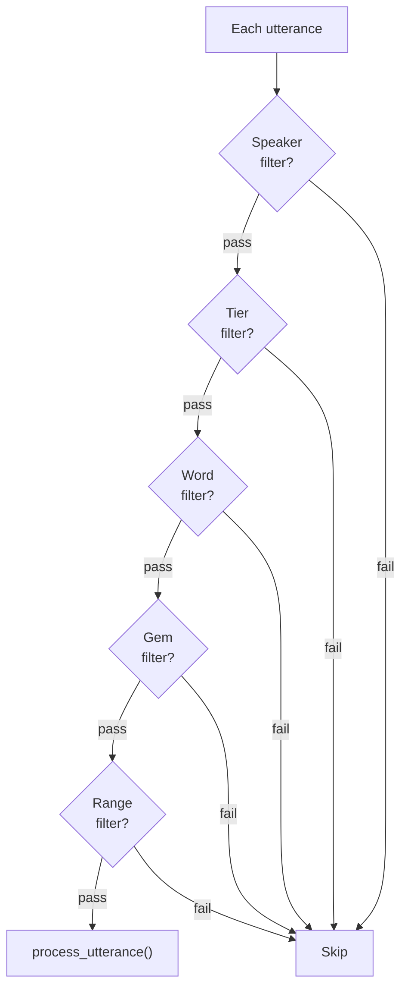

# Filtering

**Status:** Current
**Last updated:** 2026-06-15 12:55 EDT

The framework provides a unified filtering system shared across commands. Filters restrict which utterances, speakers, tiers, and words are processed. Which filters a given command exposes still varies (for example, dependent-tier selection currently lands on FREQ and CHAINS but not yet KWAL/COMBO); each filter page below notes its per-command coverage.

Multiple filters can be combined; they are applied as an AND (all must match for an utterance to be included).



## Filter types

| Filter | Flag | CLAN equivalent | Effect |
|--------|------|-----------------|--------|
| [Speaker](filtering-speakers.md) | `--speaker` / `--exclude-speaker` | `+t*` / `-t*` | Include/exclude by speaker code |
| [Tier](filtering-tiers.md) | `--tier` / `--exclude-tier` | `+t%` / `-t%` | Include/exclude dependent tiers |
| [Word](filtering-words.md) | `--include-word` / `--exclude-word` | `+s` / `-s` | Filter by word content |
| [Gem](filtering-gems.md) | `--gem` / `--exclude-gem` | `+g` / `-g` | Restrict to gem segments |
| [Range](filtering-range.md) | `--range` | `+z` | Utterance number range |
| ID | `--id-filter` | `+t@ID=` | Filter by @ID header fields |

## Examples

```bash
# Child speaker only, within a gem
chatter clan freq --speaker CHI --gem "story" file.cha

# All speakers except investigator, utterances 10-50
chatter clan mlu --exclude-speaker INV --range 10-50 file.cha

# Only utterances containing "the" (KWAL's search is +s, which maps to --keyword)
chatter clan kwal --keyword "the" file.cha
```
